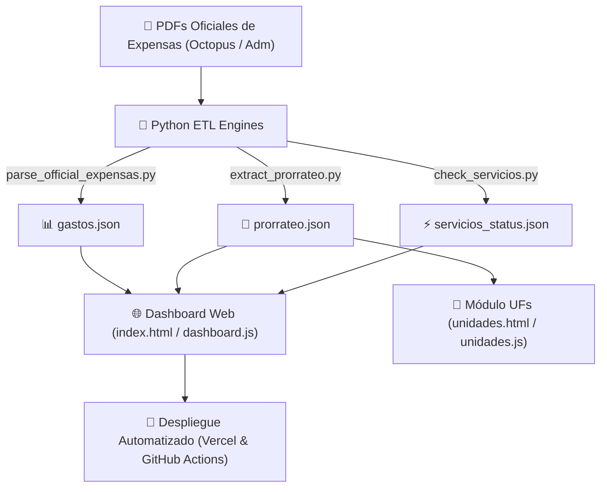

# 🏢 DOCUMENTACIÓN TÉCNICA Y ARQUITECTURA DE SOFTWARE
## Sistema Independiente de Auditoría Financiera y Monitoreo de Expensas
### Consorcio Alvear 961/963 (Retiro, CABA)

---

## 1. 📌 Resumen Ejecutivo y Alcance

El **Sistema de Auditoría de Expensas Alvear 961/963** es una plataforma web e infraestructura de ingesta automatizada concebida para brindar **transparencia financiera, auditoría contable y trazabilidad legal** a los copropietarios e inquilinos del consorcio.

### 📊 Cobertura Auditada
- **Períodos Históricos Procesados:** 48 meses continuos (**Agosto 2022 a Julio 2026**).
- **Comprobantes y Gastos Auditados:** +1.300 registros desglosados e imputados por proveedor y rubro.
- **Unidades Funcionales Auditadas:** **23 UFs** (100% de cobertura en los 48 períodos, totalizando 1.097 registros de prorrateo).
- **Masa Financiera Analizada:** +$180.000.000,00 ARS en liquidaciones oficiales.

---

## 2. 🏛️ Arquitectura General del Sistema

El sistema utiliza una arquitectura **ETL (Extract, Transform, Load) desacoplada** combinada con una aplicación web estática **Jamstack** de alto rendimiento desplegada en **Vercel** y automatizada mediante **GitHub Actions**.



---

## 3. 📂 Estructura del Proyecto y Clasificación de Archivos

```
Auditoria_Administracion_MTAlvear963/
├── index.html                   # Interfaz Principal (Cuadro de Mando, KPIs, Gráficos y Auditoría)
├── dashboard.js                 # Lógica de Negocio, Motores de Auditoría IPC y ApexCharts (v18)
├── unidades.html                # Interfaz de Unidades Funcionales (Prorrateo, Morosidad y Coeficientes)
├── unidades.js                  # Lógica de Prorrateo, Historial por UF y Auditoría de Intereses (v6)
├── cartelera_dashboard.html     # Plantilla A4 Imprimible para Cartelera del Edificio con Código QR
│
├── parse_official_expensas.py   # Motor Principal ETL: Extrae gastos desglosados y categoriza según CABA 941
├── extract_prorrateo.py         # Motor ETL Prorrateo: Extrae estados de cuenta de las 23 UFs (Págs 4-6)
├── check_servicios.py           # Scraper de Servicios Públicos (Edesur, AySA, Metrogas)
├── cron_update.py               # Coordinador General de Ingesta Automatizada
├── download_octopus.py          # Cliente API/Scraper para la descarga de PDFs de liquidación
│
├── gastos.json                  # Dataset Consolidado de Gastos Auditados (+1.300 registros)
├── prorrateo.json               # Dataset Consolidado de Prorrateo y Morosidad (1.097 registros UF)
├── servicios_status.json        # Estado de Servicios Públicos en Tiempo Real
│
├── liquidaciones/               # Repositorio de PDFs Oficiales Auditados (2022-08 a 2026-07)
├── novedades/                   # Repositorio de Comunicados y Adjuntos del Consorcio
│
├── DOCUMENTACION_TECNICA.md     # Documentación Técnica Integral del Proyecto
├── README.md                    # Guía Rápida de Uso del Repositorio
├── vercel.json                  # Configuración de Rutas de Vercel
└── requirements.txt             # Dependencias del Entorno Python (PyMuPDF, Requests, Playwright)
```

---

## 4. 🐍 Motor ETL e Ingesta de Datos (Python Pipeline)

### 4.1. Ingesta de Gastos (`parse_official_expensas.py`)
Utiliza **PyMuPDF (`fitz`)** para realizar análisis geométrico de bloques de texto en los PDFs oficiales emitidos por la plataforma Octopus.
- **Taxonomía Legal de 10 Rubros:** Mapea las secciones del PDF a los rubros oficiales establecidos por el **Código Civil y Comercial (Arts. 2044-2048)**, **Ley CABA 941 (RPA)** y el **CCT 589/10 (SUTERH)**:
  1. `Sueldos y Aportes`
  2. `Servicios Públicos`
  3. `Abonos de Servicios`
  4. `Mantenimiento de Partes Comunes`
  5. `Trabajos de Reparación en Unidades Funcionales`
  6. `Gastos Bancarios`
  7. `Gastos de Limpieza`
  8. `Gastos de Administración`
  9. `Seguros`
  10. `Otros / Varios`

### 4.2. Ingesta de Prorrateo por UF (`extract_prorrateo.py`)
Procesa las páginas de Estado de Cuenta / Prorrateo (Páginas 4, 5 y 6 del PDF oficial):
- **Soporte para Formato 2023:** En las liquidaciones de 2023, la tabla de prorrateo se dividía entre la Página 5 (UFs 1 a 18) y Página 6 (UFs 19 a 23). El script procesa ambas páginas.
- **Parsing de UFs Concatenadas:** Parsea expresiones regex complejas como `r'\b(\d{1,2})(\d{1,2}\-[\w]+)\b'` para separar números de UF de coordenadas de piso/dpto concatenadas (ej. `104-10` ➔ UF 10, 4° 10).
- **Validación Matemática:** Verifica que la sumatoria de coeficientes de las 23 UFs sume exactamente **100,0000%**.

---

## 5. 🧮 Motores de Auditoría Financiera y Reglas de Negocio (`dashboard.js`)

El tablero integra cuatro motores de auditoría financiera automatizados:

### 5.1. Discriminación de Aguinaldo / SAC (`isSacEffect`)
- **Problema:** En Junio/Julio y Diciembre/Enero, los gastos en sueldos y aportes se incrementan un 50% por el Sueldo Anual Complementario (SAC) por ley laboral CCT 589/10, lo que solía generar falsas alarmas de sobrecosto.
- **Solución:** La función `isSacEffect()` identifica renglones previsionales en meses SAC y los rotula con el distintivo **`(Inc. SAC)` en violeta**, comparando el incremento contra el mes regular previo libre de aguinaldo.

### 5.2. Clasificador de Expensas Ordinarias vs. Extraordinarias (`isExtraordinaria`)
- **Marco Legal:** Ley CABA 941 y CCyC Art. 2048.
- **Lógica de Clasificación:**
  - **Extraordinarias (🏛️ Amber):** Obras de capital, reemplazo de cañerías cloacales, impermeabilización de fachada, porteros eléctricos, pintura del edificio, fondos de reserva. Aportadas **exclusivamente por Propietarios**.
  - **Ordinarias (🏠 Teal):** Gastos de mantenimiento corriente, abonos de ascensores, sueldos, servicios públicos, insumos de limpieza. Aportadas por **Inquilinos y Propietarios**.

### 5.3. Auditoría de Tarifas de Proveedores vs. Inflación IPC INDEC (`auditProviders`)
- **Normalización de Nombres (`getNormalizedKey`):** Elimina números de factura cambiantes, lecturas de medidores KW y fechas de los conceptos para agrupar históricamente a proveedores recurrentes (Edesur, Personal, Octopus, Noplag, Gestionar, Ferazzoli, etc.).
- **Modelo Paritario IPC:** Compara el aumento interanual del proveedor contra la **inflación acumulada IPC INDEC (271,5%)**.
- **Cálculo de Desvío ($):**
  $$\text{Monto Teórico} = \text{Monto Año Anterior} \times \left(1 + \frac{\text{IPC Acumulado}}{100}\right)$$
  $$\text{Desvío } (\$) = \text{Monto Actual} - \text{Monto Teórico}$$
- **Evaluación de Alertas:**
  - 🟢 **Estable:** Aumento $\le$ IPC INDEC.
  - 🟡 **Alto:** Aumento superior al IPC por entre 5% y 25%.
  - 🔴 **Excesivo:** Aumento $> 25\%$ por encima de la inflación acumulada.

### 5.4. Excepción Comercial UF 001 (SAS 38,58%)
- La **Unidad Funcional 001 (Local Comercial SAS)** posee un coeficiente de prorrateo único del **38,5800%** ($2.135.649,54).
- Para evitar distorsionar el costo medio de los departamentos residenciales, el indicador **`🏢 Promedio Deptos (22 UF)`** computa exclusivamente el **61,42% restante** entre las 22 UFs de vivienda ($154.544,98 promedio por depto).

---

## 6. 📱 UI/UX & Sistema de Accesibilidad para Vecinos

### 6.1. Arquitectura Mobile-First
- En pantallas $\le 900px$, la barra lateral se transforma en un **Mobile Drawer deslizante** activado por una barra superior fija con botón hamburguesa (`≡`).
- Transición suave de `0.28s cubic-bezier(0.4, 0, 0.2, 1)` con efecto de difuminado (*Backdrop Blur*).

### 6.2. Sistema Universal de Tooltips Flotantes (`data-tooltip`)
- Implementa tooltips en lenguaje claro e intuitivo pensados para vecinos no nativos tecnológicos.
- **Despliegue Orientado Hacia Abajo (`top: 125%`) en Encabezados:** Evita el corte de texto por el borde del contenedor (`overflow`).
- **Iconos `ℹ️` en Columnas:** Indican claramente qué significa cada columna en las tablas de gastos y prorrateo.

---

## 7. 🛠️ Guía de Mantenimiento e Ingesta Local

### Prerrequisitos
- Python 3.10+
- PyMuPDF (`pip install pymupdf`)

### Actualización Manual de Expensas
Para ejecutar el ciclo de ingesta completo localmente:
```bash
python cron_update.py --all
```

### Proceso de Publicación
Cualquier cambio enviado a la rama `main` activa el despliegue automático en Vercel y sincroniza el repositorio GitHub:
```bash
git add .
git commit -m "feat: actualización de datos"
git push origin main
```

---

*Desarrollado y mantenido de forma independiente por copropietarios de Alvear 961/963.*
